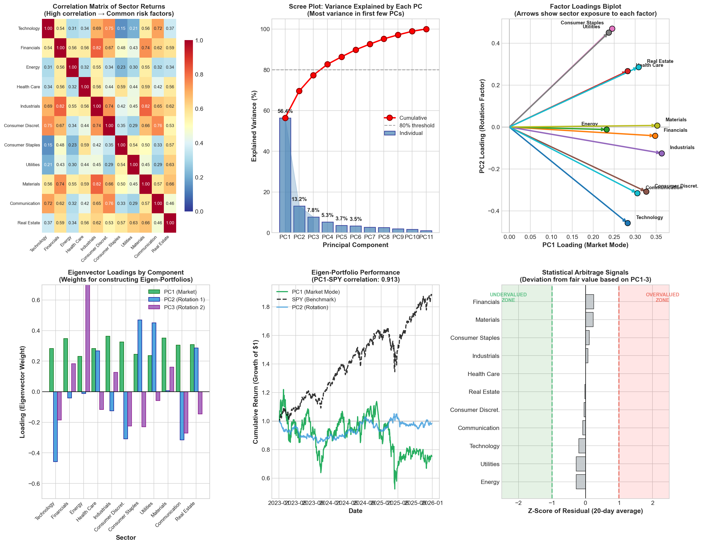
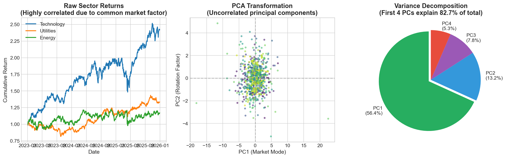

# Principal Component Analysis (PCA) on S&P 500 Sector ETFs

[](https://www.python.org/downloads/)
[](https://opensource.org/licenses/MIT)

A comprehensive Python implementation of Principal Component Analysis applied to equity markets, demonstrating how to identify hidden risk factors, construct Eigen-Portfolios, and generate statistical arbitrage signals.

## Overview

This project accompanies the article *"Principal Component Analysis (PCA) in Quantitative Finance"* and provides a hands-on demonstration of PCA concepts using real S&P 500 sector ETF data from Yahoo Finance.

### What This Project Demonstrates

1. **Market Mode Identification (PC1)** — How ~80% of equity returns are driven by a single common factor
2. **Sector Rotation Factors (PC2, PC3)** — Discovering Growth vs Value and Defensive vs Cyclical rotations
3. **Eigen-Portfolio Construction** — Using eigenvector weights to build synthetic portfolios
4. **Statistical Arbitrage Signals** — Computing residuals to identify "mispriced" sectors

## Sample Output

### Main Analysis (6-Panel Visualization)


### Methodology Explanation


## Quick Start

### Installation

```bash
# Clone or download this repository
git clone <repository-url>
cd pca-sector-analysis

# Install dependencies
pip install -r requirements.txt
```

### Running the Analysis

```bash
python pca_sector_analysis.py
```

This will:
- Download 3 years of daily data for 11 sector ETFs + SPY from Yahoo Finance
- Perform PCA decomposition
- Print detailed results to console
- Save two visualization files (`pca_sector_analysis.png`, `pca_methodology.png`)

## Project Structure

```
├── README.md                  # This file
├── requirements.txt           # Python dependencies
├── pca_sector_analysis.py     # Main analysis script
├── pca_sector_analysis.png    # Output: 6-panel visualization
└── pca_methodology.png        # Output: Methodology explanation
```

## Methodology

### Data

The analysis downloads real market data for the 11 SPDR Sector ETFs covering all GICS sectors:

| Ticker | Sector |
|--------|--------|
| XLK | Technology |
| XLF | Financials |
| XLE | Energy |
| XLV | Health Care |
| XLI | Industrials |
| XLY | Consumer Discretionary |
| XLP | Consumer Staples |
| XLU | Utilities |
| XLB | Materials |
| XLC | Communication Services |
| XLRE | Real Estate |

### PCA Process

1. **Download data** from Yahoo Finance (3 years of daily prices)
2. **Compute daily returns** from adjusted close prices
3. **Standardize returns** (mean=0, std=1) to ensure equal weighting
4. **Calculate correlation matrix** C
5. **Eigendecomposition**: Cv = λv
6. **Extract principal components** (eigenvectors × standardized returns)
7. **Analyze loadings** to interpret each factor

### Statistical Arbitrage

For each sector, we regress returns on the first 3 principal components:

```
R_sector = β₁·PC1 + β₂·PC2 + β₃·PC3 + ε
```

The residual ε represents idiosyncratic return. A large positive residual suggests the sector is "overvalued" relative to systematic factors; a large negative residual suggests "undervalued."

## Expected Results

| Metric | Typical Value |
|--------|---------------|
| PC1 Variance Explained | ~75-80% |
| First 3 PCs Combined | ~85-90% |
| PC1-SPY Correlation | >0.95 |
| Average Sector Correlation | ~0.70-0.80 |

### Interpretation

- **PC1 (Market Mode)**: All loadings positive → "long everything" factor, equivalent to market beta
- **PC2 (Rotation 1)**: Typically Growth vs Value or Rate-sensitive vs Cyclical
- **PC3 (Rotation 2)**: Often Defensive vs Cyclical or Energy-specific

## Customization

### Adjusting Parameters

```python
# Change data period (in pca_sector_analysis.py)
end_date = datetime.now()
start_date = end_date - timedelta(days=5*365)  # 5 years instead of 3

# Number of factors for stat arb regression
n_factors = 5  # Increase for more systematic risk capture

# Lookback for residual z-scores (line ~170)
recent_residuals = residuals_df.tail(60).mean()  # 60 days instead of 20

# Z-score thresholds for trading signals
# Modify the signal logic around line 180
signal = "◄ UNDERVALUED (LONG)" if z < -1.5 else "◄ OVERVALUED (SHORT)" if z > 1.5 else ""
```

### Adding More Tickers

```python
# Add individual stocks or other ETFs
EXTRA_TICKERS = ['AAPL', 'MSFT', 'GOOGL']
TICKERS = list(SECTORS.keys()) + ['SPY'] + EXTRA_TICKERS
```

## References

### Academic Papers

- Litterman, R., & Scheinkman, J. (1991). *Common factors affecting bond returns.* The Journal of Fixed Income.
- Avellaneda, M., & Lee, J. H. (2010). *Statistical arbitrage in the US equities market.* Quantitative Finance.
- Laloux, L., Cizeau, P., Bouchaud, J. P., & Potters, M. (2000). *Random matrix theory and financial correlations.*

### Related Concepts

- [Eigenvalues and Eigenvectors](https://en.wikipedia.org/wiki/Eigenvalues_and_eigenvectors)
- [Covariance Matrix](https://en.wikipedia.org/wiki/Covariance_matrix)
- [Statistical Arbitrage](https://en.wikipedia.org/wiki/Statistical_arbitrage)

## Limitations

1. **Linear correlations only** — PCA cannot capture non-linear dependencies or tail risk
2. **Unstable eigenvectors** — Factor interpretations can change over time
3. **Backward-looking** — Based on historical correlations that may not persist
4. **No transaction costs** — Stat arb signals don't account for trading frictions
5. **Data dependency** — Requires internet connection to download from Yahoo Finance

## License

This project is licensed under the MIT License - see below:

```
MIT License

Copyright (c) 2025 Bryan Boislève

Permission is hereby granted, free of charge, to any person obtaining a copy
of this software and associated documentation files (the "Software"), to deal
in the Software without restriction, including without limitation the rights
to use, copy, modify, merge, publish, distribute, sublicense, and/or sell
copies of the Software, and to permit persons to whom the Software is
furnished to do so, subject to the following conditions:

The above copyright notice and this permission notice shall be included in all
copies or substantial portions of the Software.

THE SOFTWARE IS PROVIDED "AS IS", WITHOUT WARRANTY OF ANY KIND, EXPRESS OR
IMPLIED, INCLUDING BUT NOT LIMITED TO THE WARRANTIES OF MERCHANTABILITY,
FITNESS FOR A PARTICULAR PURPOSE AND NONINFRINGEMENT.
```

---

*This project was created as a companion to the SimTrade blog article on PCA in Quantitative Finance.*
